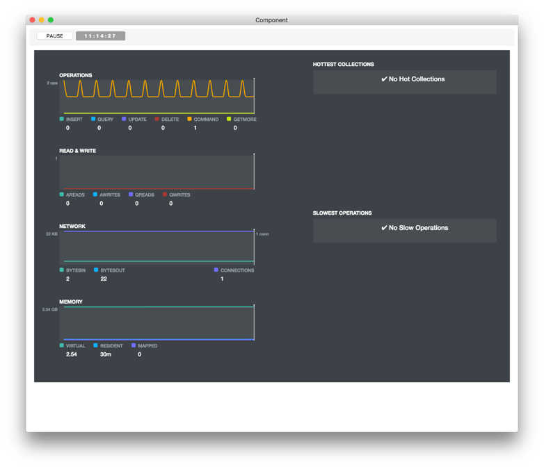
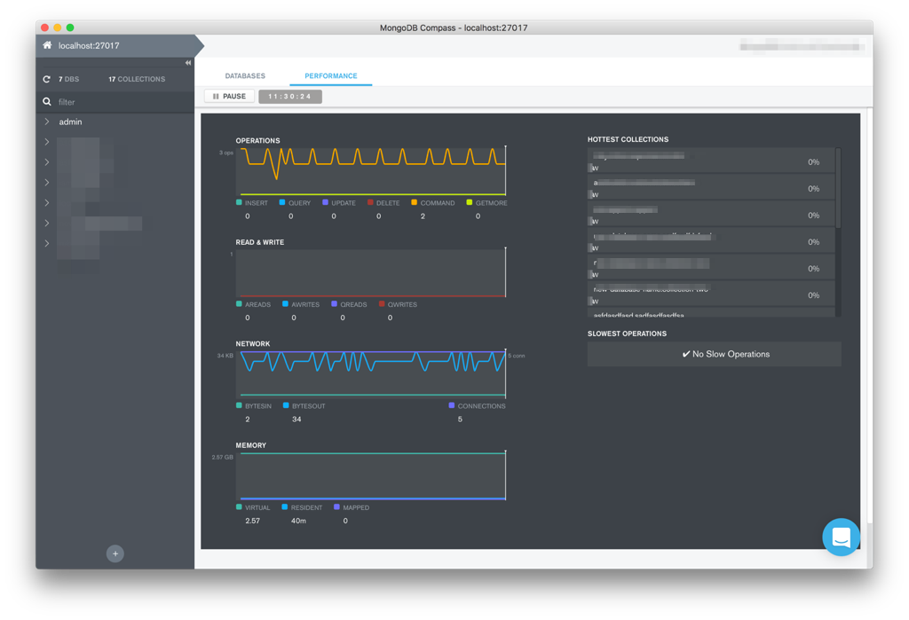
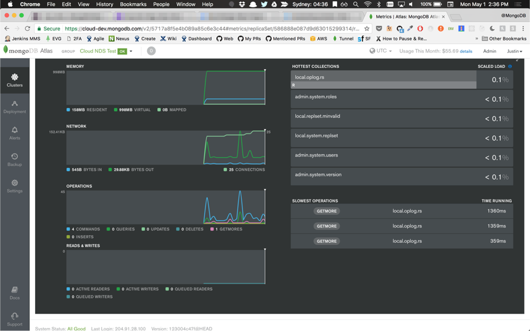
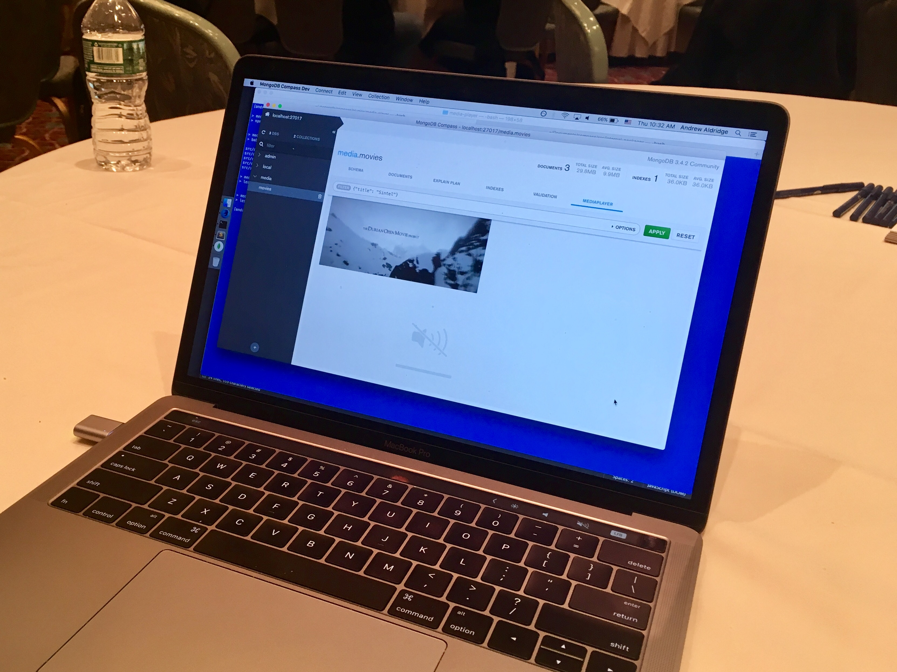
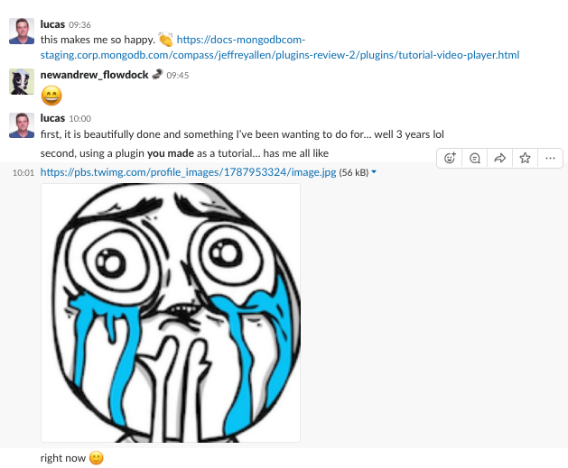

autoscale: true

# [fit] Compass Plugins

# [_lucas@mongodb.com_](mailto:lucas@mongodb.com)

<!-- ---

## [fit] :wave: PhillyMUG -->

^ me. I ❤️ data. Programming, devops, ux, startups for over ten years.
^ MongoDB user since 2.0. Staff Engineer in Enterprise Tools
^ bic, compass charts, and a few other things.

---

# [fit] :zap:

---

# [fit] 🤔

^ Plugins is a big topic to cover in such a short amount of time.
^ There's lots of code on GitHub I'll link you to and some amazing tutorials and docs.
^ So instead of getting into code, I tell you about where plugins come from and where I think they're going.

---

# [fit] Goals for Tonight

1.  What are plugins?
2.  Where did they come from?
3.  Why do plugins matter?

[.build-lists: true]

---

# [fit] 0. What's Compass?

---

^ Compass is our official desktop GUI for working with MongoDB we released initially in December 2015.
^ It’s built on Electron, node.js, and react. JS through and through.
^ Work closely with Matt’s team and Cloud team. Compass on desktop is this weird, lovable, awesome middle ground.
^ It now comes in 3 different flavors: Enterprise, Community which we launched in November 2017 and the new Isolated distribution.
^ Compass’ mission is to enable human’s to work with MongoDB without requiring experience with programming or databases.

---

# [fit] 1. What are Compass Plugins?

---

# [fit] Compass Plugin Framework

* React components for UI
* Glue for plugins to communicate with each other
* Reusable across Electron or Web

^ > When did they launch? What are they?
^ The _PLUGIN FRAMEWORK_ is actually not as scary as it sounds.
^ Internally, we refer to plugins as hadron: tiny, connected pieces that make everything.  
^ hadron modules are all open source. They simply provide a way for React components to collaborate and abstract away some of the electron specific API calls.

---

# [fit] Compass Plugins are **NOT**

* ~~Related to MongoDB Server, drivers, anything else~~
* ~~Require rewriting your React components~~
* ~~"The community will do it for us!"~~

^ Where plugins came from was not an innate desire to create the _PLUGIN FRAMEWORK_. Not a way for us to get other people to do the work for a feature.

---

# [fit] 2. Where did they come from?

---

# Origins of Plugins

# [fit] Distributed Team

^ It is impossible for everyone on the team to have a meeting at the same time without someone being awake ridiculously early or late.
^ Work and test features independently.

---

# Origins of Plugins

# [fit] Iteration :arrow_up:

^ Make it easy to try ideas for features, get people to use them, throw them away or improve.
^ There have been over 100 releases of Compass

---

# Origins of Plugins

# [fit] Cross-Product Reuse

^ Consistent experience across our products and not implement the same feature over and over.

---

# Example

# [fit] Server Stats Plugin

---

## Plugin

---

## In Compass

---

## In Atlas

---

# [fit] 3. Why do plugins matter?

---

> _Why should everyone have to use the same tools for different problems?_

^ Opened up Compass Plugins to be hackable because of a core, hard question: Why should everyone have to use the same tools for different problems?

---

# Example

# [fit] `BinaryData('asdias...')`

^ BinarayData fields are boring. `BinaryData('asdias...')` is how a computer relates to that information, not a human.
^ We did a pilot of Compass Plugins at our most recent engineering offsite. We put together a mini workshop for the first day, helped people get started and productive.
^ On the last day of the offsite, we had a science fair style judging where people that created a plugin would signup in a google form to get a demo table.
^ I saw one come in on the form I hadn’t see in person but sounded really appealing: Video Player Plugin.

---

^ I ran across the venue and took this photo of Andrew’s laptop
^ Andrew reused his plugin for docs examples

---

^ Slack screenshot after realizing
^ This makes me incredibly happy.

---

# So...

^ So...

---

# [fit] What's next?

^ What's next?
^ Hopefully, we've accomplished our 3 goals for the night.
^ If so I'd like to give you a challenge: What is a data-first IDE?
^ We are long past the end of excel layouts or data grids with context menus being a solution.

---

# [fit] ~~excel tables~~

---

# [fit] ~~data grids~~

---

# [fit] ~~JSON editor~~

---

# [fit] ?

^ I don't know the answer here.
^ My bet is that somebody out there does.
^ Multiple somebodies.
^ Which is why plugins matter so much.

---

# [fit] Diversity is required.

^ Working with data requires fresh perspectives on solving problems.

# [fit] Let's build together.

^ Working with data requires fresh perspectives on solving problems.

---

# [fit] thanks

## [fit][bit.ly/awesome-compass](https://bit.ly/awesome-compass)

## [fit][lucas@mongodb.com](mailto:lucas@mongodb.com)

^ Know a bit of javascript or are willing to learn? Here’s a safe toolkit for making your day or your teams easier/brighter when MongoDB is involved in your work.
^ We want your help to make all of this work.
^ Go to URL xxx for details or email me
^ Thanks for listening.
